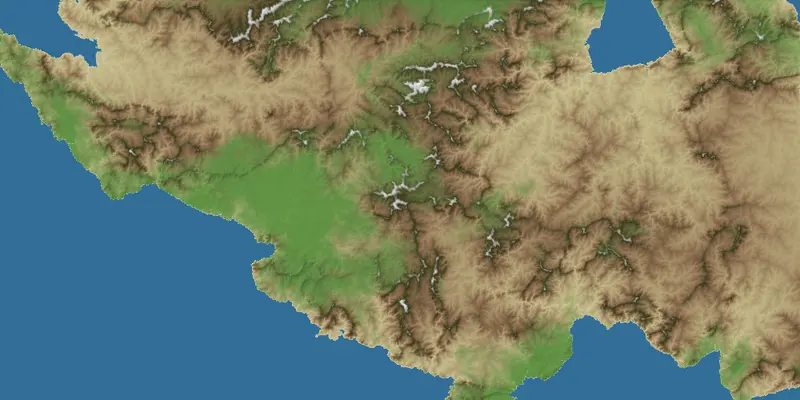

# fastlem



[](https://crates.io/crates/fastlem)
[](https://docs.rs/fastlem)

fastlem is a Rust library that provides methods for creating virtual terrains based on a landscape evolution model (LEM). It creates terrain data with plausible reliefs by simulating the erosion process from a given initial topographical parameters. It helps you to create or generate realistic terrains for your creative projects. 

> [!WARNING]
> This project is now in development. During `0.1.*`, the interface may change a lot.

## Examples

|**Simple Landscape Evolution**|**Simple Terrain Generation**|
|:---:|:---:|
|||
|```$ cargo run --example landscape_evolution --release```|```$ cargo run --example terrain_generation --release```|

|**Advanced Terrain Generation**|**Terrain Generation from Given Parameters**|
|:---:|:---:|
|||
|```$ cargo run --example terrain_generation_advanced --release```|```$ cargo run --example sample_terrain --release```|

## Documentations

See the [fastlem wiki](https://github.com/TadaTeruki/fastlem/wiki) how to use fastlem.

Also the [examples](https://github.com/TadaTeruki/fastlem/tree/main/examples) and [API reference](https://docs.rs/fastlem/latest/fastlem/) are useful. Reading the [landscape_evolution.rs](https://github.com/TadaTeruki/fastlem/blob/main/examples/landscape_evolution.rs) is recommended as a first step.
