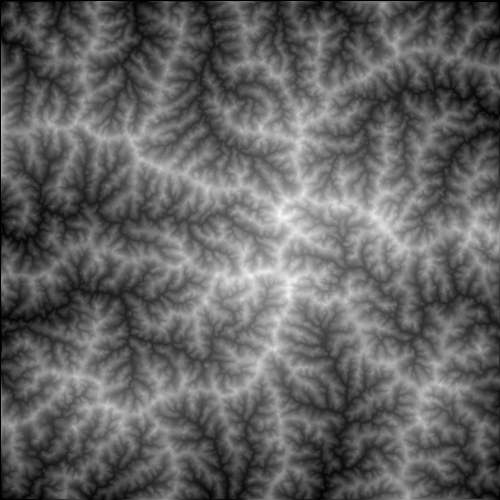
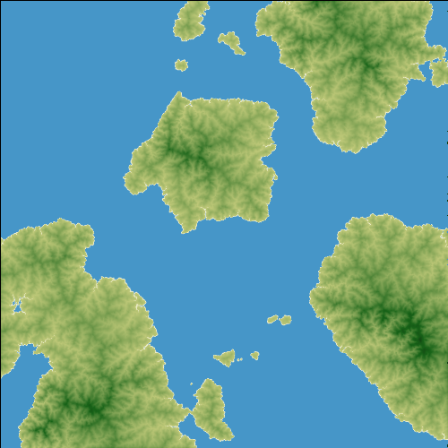
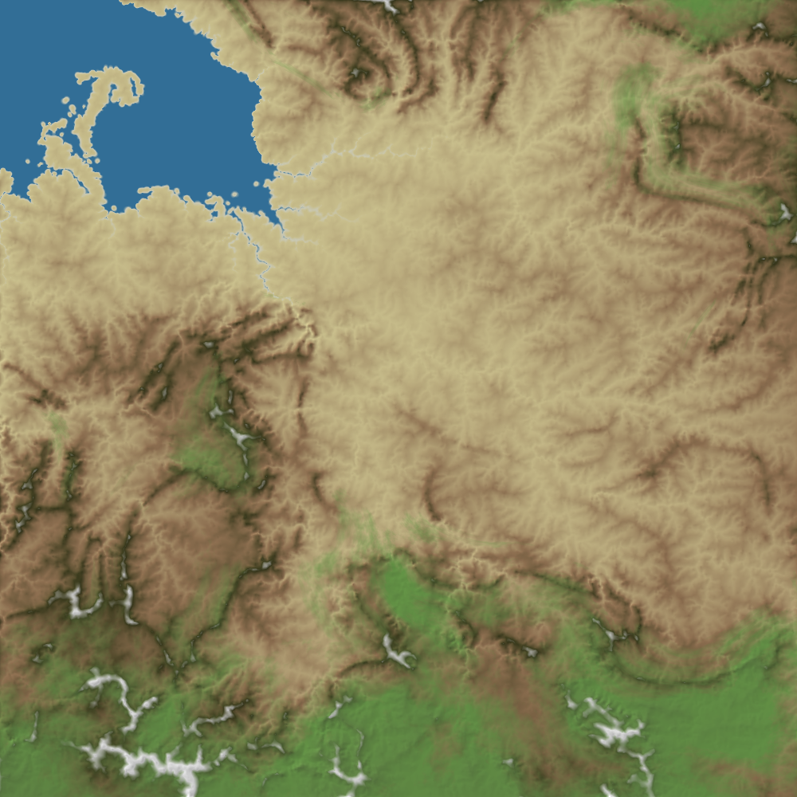
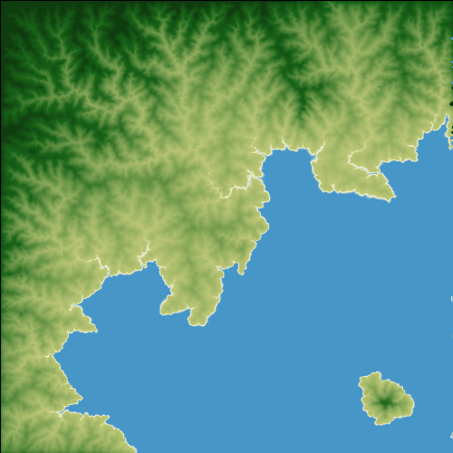

# fastlem


fastlem is a Rust library that provides methods for creating virtual terrains based on a simplified landscape evolution model (LEM). It generates terrain data with plausible reliefs by simulating the erosion process from a given initial topographical parameters. It helps you to create or generate realistic terrains for your creative projects. 

> [!WARNING]
> This project is now in development. During `0.1.*`, the interface may change a lot.

## Previews

**Simple Landscape Evolution**

```
$ cargo run --example landscape_evolution --release
```



**Simple Terrain Generation**

```
$ cargo run --example terrain_generation --release
```



**Advanced Terrain Generation**

```
$ cargo run --example terrain_generation_advanced --release
```



**Terrain Generation from Given Parameters**

```
$ cargo run --example sample_terrain --release
```


